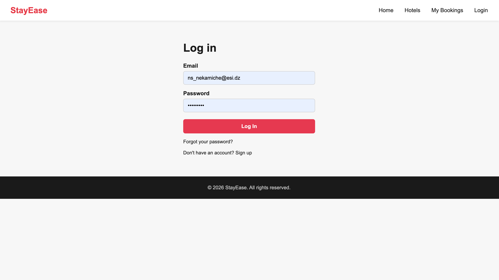
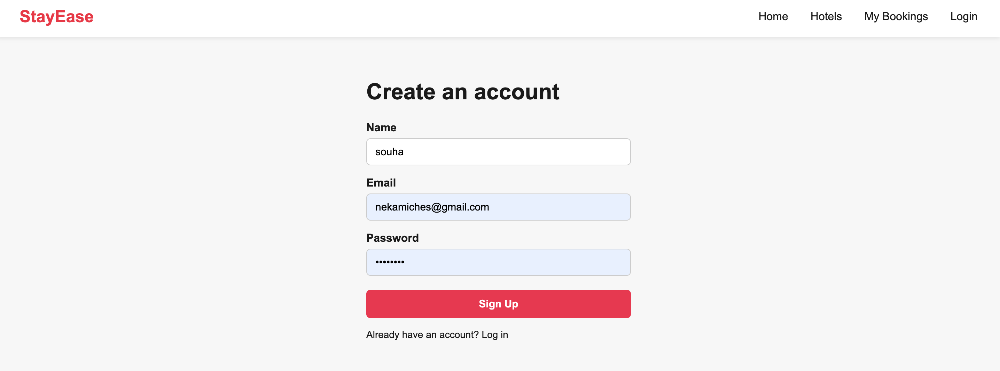
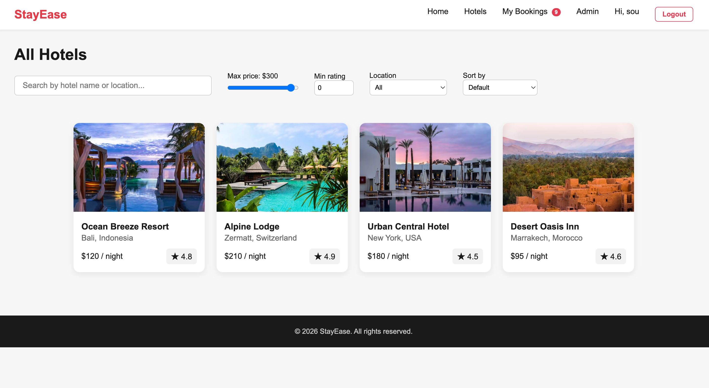
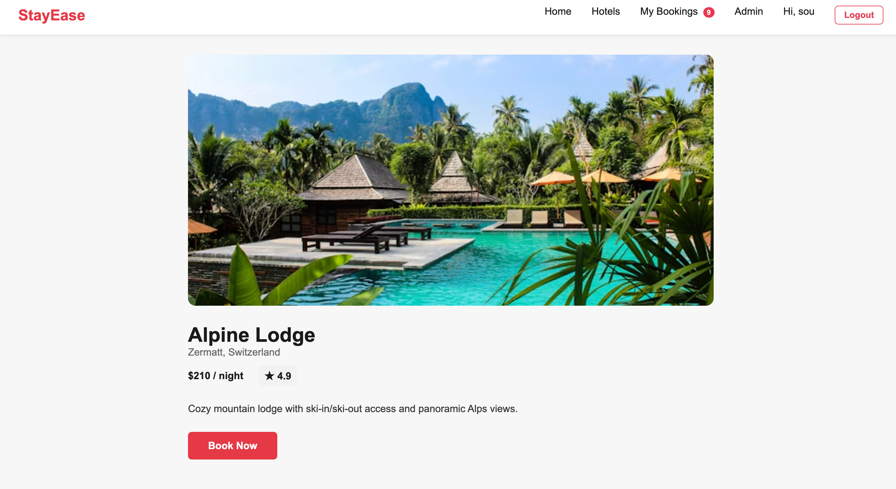
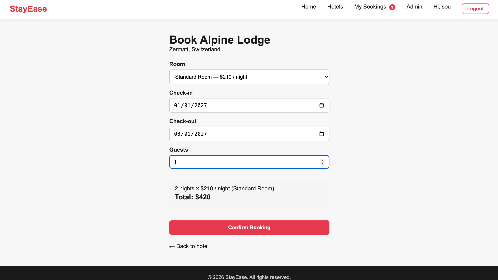
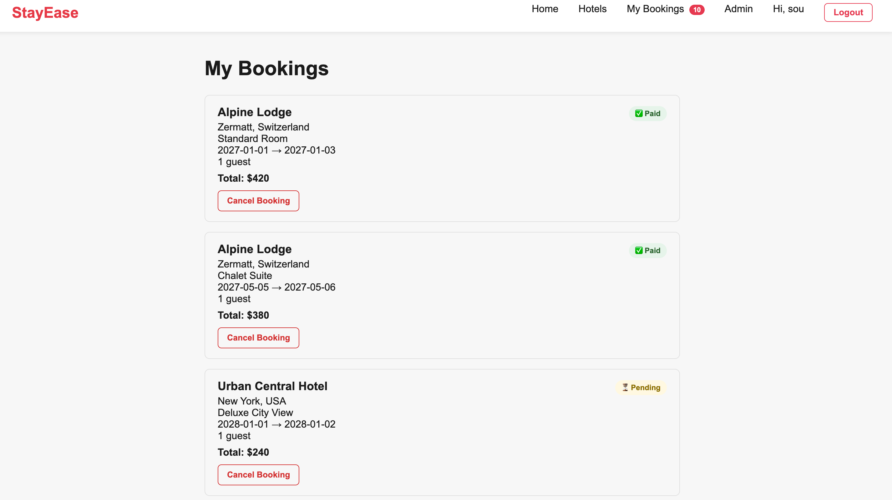
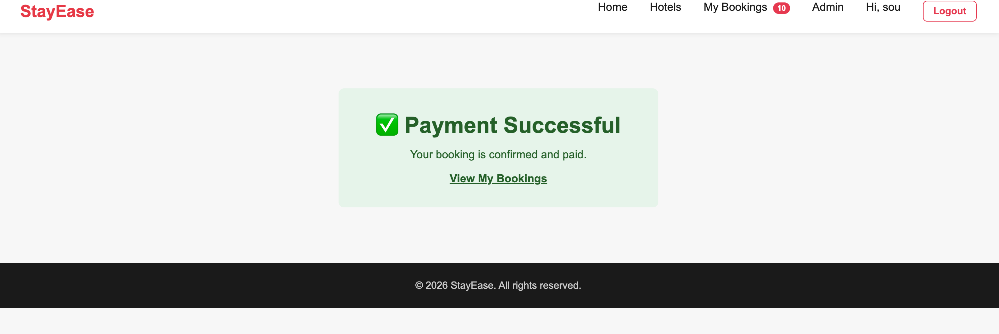

# 🏨 StayEase

A full-stack hotel booking application with real-time availability, secure payments, and user authentication.

🌐 **[Live Demo](https://stayease-swart.vercel.app)** | 💻 **[GitHub Repository](https://github.com/sou-315/stayease)**

---

## 📸 Screenshots

| Feature | Screenshot |
|---------|-----------|
| Login |  |
| Signup |  |
| Hotels Listing |  |
| Hotel Details |  |
| Booking Form |  |
| My Bookings |  |
| Payment Success |  |

---

## ✨ Features

- **🔍 Hotel Search & Filtering** — Browse hotels by price, rating, location, and availability
- **🛏️ Room Selection** — Choose room types with dynamic pricing
- **💳 Secure Payments** — Integrate with Chargily for DZD payment processing
- **🔐 User Authentication** — JWT-based login, signup, and password reset
- **📅 Booking Management** — View, track, and cancel reservations
- **✉️ Email Notifications** — Password reset and booking confirmations via Mailtrap
- **⭐ Ratings & Reviews** — Hotel ratings and user reviews
- **📱 Responsive Design** — Mobile-friendly UI

---

## 🛠️ Tech Stack

### **Frontend**
- **React 18** — UI library with Hooks
- **React Router** — Client-side routing
- **Vite** — Build tool and dev server
- **CSS3** — Styling and animations

### **Backend**
- **PHP 8.4** — Server-side logic
- **MySQL** — Relational database
- **PHPMailer** — Email delivery

### **Infrastructure**
- **Vercel** — Frontend hosting (React/Vite)
- **Railway** — Backend hosting (PHP + MySQL)
- **Mailtrap** — Email testing/delivery sandbox
- **Chargily Pay** — Payment gateway (DZD)

### **Libraries & Tools**
- **php-jwt** — JWT token generation/verification
- **vlucas/phpdotenv** — Environment variable management
- **phpmailer/phpmailer** — Email sending

---


## 📁 Project Structure
stayease/
├── frontend/ # React application (Vercel)
│ ├── src/
│ │ ├── components/ # Reusable UI components
│ │ ├── pages/ # Page components (Home, Login, etc.)
│ │ ├── context/ # AuthContext, BookingsContext
│ │ ├── utils/ # Helper functions
│ │ ├── config.js # API_URL configuration
│ │ └── App.jsx # Main app with routing
│ ├── package.json
│ └── vite.config.js
│
├── backend/ # PHP API (Railway)
│ ├── hotels.php # GET/POST hotels, filter by ID
│ ├── login.php # User login endpoint
│ ├── signup.php # User registration
│ ├── forgot_password.php # Password reset request
│ ├── reset_password.php # Password reset confirmation
│ ├── bookings.php # Create/view bookings
│ ├── create_checkout.php # Chargily checkout creation
│ ├── chargily_webhook.php # Payment confirmation webhook
│ ├── db.php # Database connection
│ ├── auth_middleware.php # JWT verification
│ ├── jwt_helper.php # Token generation
│ ├── .env.example # Environment template
│ └── composer.json # PHP dependencies
│
├── screenshots/ # Documentation screenshots
├── .gitignore
├── README.md # This file
└── hotel-booking-app.code-workspace

---

## 🗄️ Database

### **Tables**

**users**
```sql
CREATE TABLE users (
  id INT PRIMARY KEY AUTO_INCREMENT,
  name VARCHAR(255) NOT NULL,
  email VARCHAR(255) UNIQUE NOT NULL,
  password VARCHAR(255) NOT NULL,
  role ENUM('user', 'admin') DEFAULT 'user',
  reset_token VARCHAR(255),
  reset_token_expiry DATETIME,
  created_at TIMESTAMP DEFAULT CURRENT_TIMESTAMP
);
```

**hotels**
```sql
CREATE TABLE hotels (
  id INT PRIMARY KEY AUTO_INCREMENT,
  name VARCHAR(255) NOT NULL,
  location VARCHAR(255),
  price INT,
  rating FLOAT,
  image VARCHAR(255),
  description TEXT,
  amenities JSON,
  created_at TIMESTAMP DEFAULT CURRENT_TIMESTAMP
);
```

**rooms**
```sql
CREATE TABLE rooms (
  id INT PRIMARY KEY AUTO_INCREMENT,
  hotel_id INT NOT NULL,
  name VARCHAR(255),
  room_type VARCHAR(100),
  price INT,
  FOREIGN KEY (hotel_id) REFERENCES hotels(id) ON DELETE CASCADE
);
```

**bookings**
```sql
CREATE TABLE bookings (
  id INT PRIMARY KEY AUTO_INCREMENT,
  user_id INT NOT NULL,
  hotel_id INT NOT NULL,
  room_id INT NOT NULL,
  check_in DATE,
  check_out DATE,
  guests INT,
  total INT,
  payment_status ENUM('pending', 'paid', 'cancelled') DEFAULT 'pending',
  checkout_id VARCHAR(255),
  created_at TIMESTAMP DEFAULT CURRENT_TIMESTAMP,
  FOREIGN KEY (user_id) REFERENCES users(id),
  FOREIGN KEY (hotel_id) REFERENCES hotels(id),
  FOREIGN KEY (room_id) REFERENCES rooms(id)
);
```

---

## 🔐 Authentication & Security

### **JWT Flow**
1. User logs in with email/password
2. Backend verifies credentials against hashed password
3. Backend generates JWT token (signed with `JWT_SECRET`)
4. Frontend stores token in localStorage
5. All authenticated requests include `Authorization: Bearer <token>` header
6. Backend verifies token signature & expiry on each request

### **Security Measures**
- ✅ Passwords hashed with `PASSWORD_DEFAULT` (bcrypt)
- ✅ JWT tokens expire after configurable time
- ✅ CORS restricted to production frontend domain
- ✅ Password reset tokens are single-use, time-limited (1 hour)
- ✅ SQL injection prevention via prepared statements
- ✅ HTTPS enforced in production

### **Password Reset Flow**
1. User requests reset via email
2. Backend generates random 64-char token
3. Token stored in DB with 1-hour expiry
4. Email sent with reset link: `/reset-password?token=<token>`
5. User clicks link, sets new password
6. Token verified & password updated
7. Token invalidated after use

---

## 💳 Payment Integration

### **Chargily Setup**
- **Provider**: Chargily Pay (DZD payment gateway)
- **Endpoint**: `https://pay.chargily.net/test/api/v2/checkouts` (test mode)
- **Payment Methods**: EDAHABIA & CIB bank cards (Algeria)

### **Checkout Flow**
1. User confirms booking on frontend
2. Frontend calls `/create_checkout.php` with `bookingId`
3. Backend creates Chargily checkout session
4. Backend converts price from USD to DZD (rate: 1 USD = 260 DZD)
5. Chargily returns `checkout_url`
6. User redirected to Chargily's hosted payment page
7. User enters card details and confirms payment
8. On success, Chargily redirects to `/booking-success?bookingId=...`
9. Chargily sends webhook to `/chargily_webhook.php`
10. Backend updates booking status to `paid`

### **Important Notes**
- Test mode uses Chargily's sandbox (no real charges)
- Webhook must be publicly accessible for Chargily to call it
- USD→DZD exchange rate is approximate; update as needed
- Payment status updated only when webhook is received, not on redirect

---

## 🚀 Installation

### **Prerequisites**
- Node.js 16+ (for frontend build)
- PHP 8.4+ (for local backend development)
- MySQL 8.0+ (for local database)
- Composer (for PHP dependencies)

### **Local Development**

**1. Clone the repository**
```bash
git clone https://github.com/sou-315/stayease.git
cd stayease
```

**2. Frontend setup**
```bash
cd frontend
npm install
npm run dev
# Runs on http://localhost:5173
```

**3. Backend setup**
```bash
cd backend
composer install
cp .env.example .env
# Edit .env with local database credentials
php -S localhost:8000
# API runs on http://localhost:8000
```

**4. Database setup**
```bash
mysql -u root -p < database.sql
# Or create tables manually using schema above
```

### **Deployment**

**Frontend → Vercel**
```bash
# Vercel auto-deploys on push to main branch
# Make sure Root Directory is set to `frontend/`
git push origin main
```

**Backend → Railway**
```bash
# Railway auto-deploys on push to main branch
# Set these env vars in Railway dashboard:
# - DB_HOST, DB_NAME, DB_USER, DB_PASS, DB_PORT
# - JWT_SECRET
# - CHARGILY_SECRET_KEY
# - MAILTRAP_HOST, MAILTRAP_USERNAME, MAILTRAP_PASSWORD, MAILTRAP_PORT
git push origin main
```

---

## ⚙️ Environment Variables

### **Frontend** (`frontend/.env`)
```env
VITE_API_URL=http://localhost:8000  # Local: http://localhost:8000
                                     # Production: https://stayease-production-38bf.up.railway.app
```

### **Backend** (`backend/.env`)
```env
# Database
DB_HOST=localhost
DB_NAME=stayease
DB_USER=root
DB_PASS=your_password
DB_PORT=3306

# JWT
JWT_SECRET=your_secret_key_here

# Chargily Payments
CHARGILY_SECRET_KEY=test_sk_...

# Mailtrap Email
MAILTRAP_HOST=sandbox.smtp.mailtrap.io
MAILTRAP_PORT=465
MAILTRAP_USERNAME=your_username
MAILTRAP_PASSWORD=your_password
```

### **Railway Variables** (Production)
All backend `.env` variables must be added to Railway's **Variables** tab for the `stayease` service:
- `DB_HOST` (Railway MySQL host)
- `DB_NAME`, `DB_USER`, `DB_PASS`
- `JWT_SECRET` (generate a strong random string)
- `CHARGILY_SECRET_KEY`
- `MAILTRAP_HOST`, `MAILTRAP_PORT`, `MAILTRAP_USERNAME`, `MAILTRAP_PASSWORD`

---

## 🧪 Testing

### **Manual Testing Checklist**

- [x] **Login** — Valid email/password logs in, invalid rejects
- [x] **Signup** — New account creation works, duplicate email rejected
- [x] **Hotels** — List loads, search/filter works
- [x] **Hotel Details** — Single hotel view shows rooms & pricing
- [x] **Booking** — Date selection, room choice, price calculation correct
- [x] **Checkout** — Redirects to Chargily, test payment processes
- [x] **My Bookings** — Paid booking shows in list with correct status
- [x] **Forgot Password** — Email sent, reset link works
- [x] **Logout** — Clears auth, redirects to home
- [x] **Session Persistence** — Page refresh stays logged in

### **Test Accounts** (on Railway MySQL)
- Email: `ns_nekamiche@esi.dz` | Password: `password123`
- Email: `test@example.com` | Password: `test1234`

### **Common Issues & Fixes**

| Issue | Cause | Solution |
|-------|-------|----------|
| API calls return 401 "Unauthorized" | Wrong endpoint URL | Check frontend fetch URLs match actual backend files |
| CORS blocked errors | Frontend/backend domain mismatch | Update `Access-Control-Allow-Origin` in PHP headers |
| Booking fails silently | `create_checkout.php` env vars empty | Use `getenv()` instead of `$_ENV[]` |
| Password reset hangs 30s | SMTP connection timeout | Change `MAILTRAP_PORT` to `465` with `SMTPSecure = 'smtps'` |
| Webhook payment status not updating | Chargily can't reach webhook | Ensure public URL is correct and deployed |

---

## 👩‍💻 My Contribution

This project was built as a full-stack hotel booking application with the following deliverables:

- ✅ Complete React frontend with routing and state management
- ✅ PHP REST API with authentication, authorization, and database integration
- ✅ MySQL database design with proper relationships
- ✅ Payment integration with Chargily (DZD support)
- ✅ Email system for notifications and password resets
- ✅ JWT-based user authentication
- ✅ Comprehensive testing and bug fixes for production deployment
- ✅ Deployment on Vercel (frontend) and Railway (backend)

**Key accomplishments:**
- Fixed critical deployment bugs (endpoint URLs, environment variables, SMTP connectivity)
- Implemented secure payment flow with webhook confirmation
- Designed scalable architecture separating frontend and backend
- Configured CORS, JWT, and database security
- Troubleshot and resolved production-specific issues (dotenv crashes, email delivery, network restrictions)

---

## 🔮 Future Improvements

- [ ] **Admin Dashboard** — Manage hotels, bookings, and users
- [ ] **Advanced Filtering** — Date range, amenities, price sliders
- [ ] **User Reviews** — Rate hotels and read guest feedback
- [ ] **Booking Cancellation** — Allow refunds with cancellation policy
- [ ] **Multi-language Support** — Arabic, French, English UI
- [ ] **Real-time Notifications** — WebSocket updates for booking status
- [ ] **Payment Methods** — Support for multiple gateways (Stripe, PayPal)
- [ ] **Analytics** — Track bookings, revenue, popular hotels
- [ ] **Mobile App** — React Native or Flutter for iOS/Android

---

## 📄 License

This project is licensed under the MIT License — see the LICENSE file for details.

---

**Questions or issues?** Open an issue on [GitHub](https://github.com/sou-315/stayease/issues).

**Live Demo:** https://stayease-swart.vercel.app
